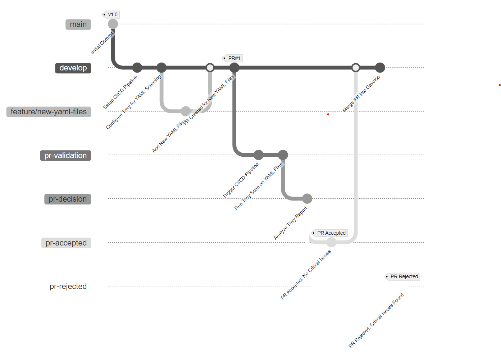
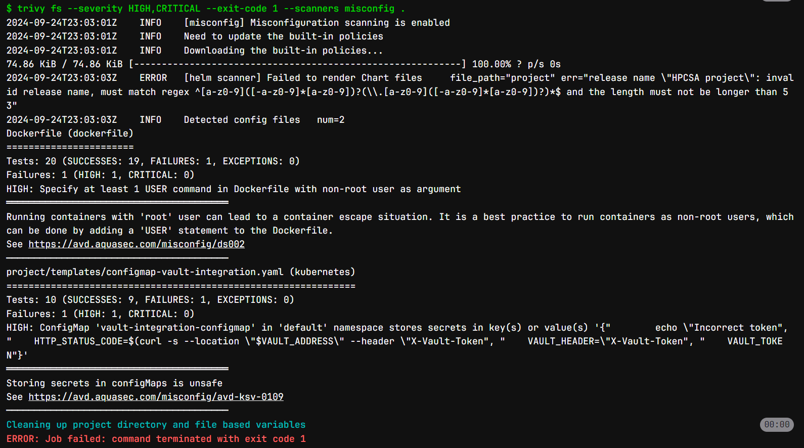
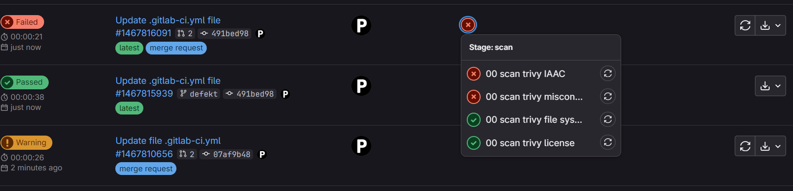

# GitLab CI/CD Pipeline with Trivy Security Scans

This repository contains a comprehensive GitLab CI/CD pipeline designed to integrate security scanning using Trivy as a core component. The pipeline scans YAML files and container images submitted through Pull Requests (PRs) and makes decisions based on the severity and number of vulnerabilities detected.

## Table of Contents
- [Architecture Overview](#architecture-overview)
- [Pipeline Workflow](#pipeline-workflow)
- [Configuration](#configuration)
- [Custom GitLab Runner](#custom-gitlab-runner)
- [Reports](#reports)
- [Decision Criteria](#decision-criteria)
- [Usage](#usage)

## Architecture Overview

The pipeline is structured to automatically scan for vulnerabilities whenever a PR is submitted. It is equipped to:
- Scan YAML files and container images for vulnerabilities.
- Generate detailed reports with Trivy.
- Make automated decisions based on predefined criteria about whether a PR is accepted or rejected.

## Pipeline Workflow

The CI/CD pipeline begins when a PR is created. The stages of the pipeline include:
1. **Build**: Builds the application or container image.
2. **Scan**: Runs Trivy security scans on YAML files and container images.
3. **Report**: Generates reports based on scan results.
4. **Decision**: Accepts or rejects the PR based on the scan reports.

For more details, refer to the architecture diagram:



## Configuration

The GitLab CI/CD pipeline is defined in the `.gitlab-ci.yml` file. It outlines the stages, jobs, and their respective triggers.

### Example Configuration

```yaml
stages:
  - build
  - scan
  - report
  - deploy

scan:
  stage: scan
  script:
    - trivy --severity HIGH,CRITICAL --exit-code 1 --ignore-unfixed .
  only:
    - merge_requests
```

You can find more detailed configurations in the `.gitlab-ci.yml` file.

## Custom GitLab Runner

A custom GitLab Runner is used to meet the specific requirements of this pipeline. The runner is built from a Dockerfile that includes necessary dependencies like Trivy. The runner ensures that each job is executed within a secure and isolated environment.

The Dockerfile used for the runner is available in the Appendix.

## Reports

Trivy generates multiple types of reports:
- **Vulnerability reports**: Highlight critical, high, medium, and low severity vulnerabilities.
- **Misconfiguration reports**: Highlight potential misconfigurations in YAML and other configuration files.

Example of a report:



## Decision Criteria

The pipeline includes an automated admission control mechanism to determine whether a PR is accepted or rejected. The criteria include:
- **Critical vulnerabilities**: Result in automatic rejection of the PR.
- **High, Medium vulnerabilities**: Provide warnings, but the PR might still be accepted based on thresholds.
  
Rejected PRs are provided with actionable feedback in the form of comments, guiding the submitter on how to resolve the vulnerabilities.



## Usage

1. **Clone the repository**:
   ```bash
   git clone https://github.com/pranay-bh/trivy.git
   cd trivy
   ```

2. **Configure the GitLab Runner**:
   - Ensure your runner is set up with the necessary dependencies to support the Trivy scan.
   - Register the runner with your GitLab project.

3. **Pipeline execution**:
   - Create a PR in your repository to trigger the CI/CD pipeline.
   - The pipeline will automatically run the security scans and generate reports.
   - Based on the scan results, the pipeline will either accept or reject the PR.

4. **Review reports**:
   - If the pipeline fails, review the Trivy report to understand the vulnerabilities.
   - Make the necessary changes and re-submit the PR.

---

This repository demonstrates how to integrate security scanning into a CI/CD pipeline, ensuring that your code remains secure before it is merged into the main branch. 
