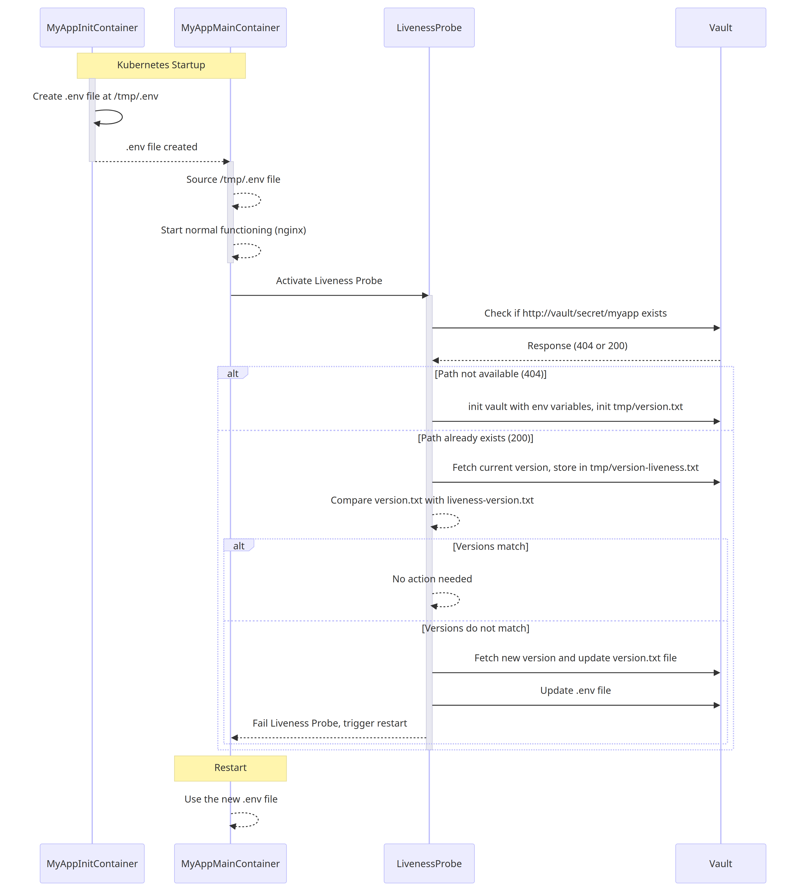
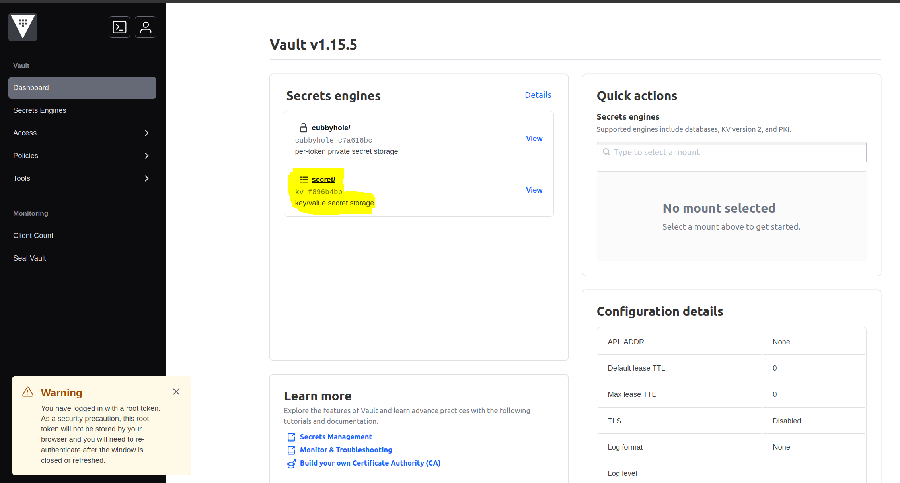
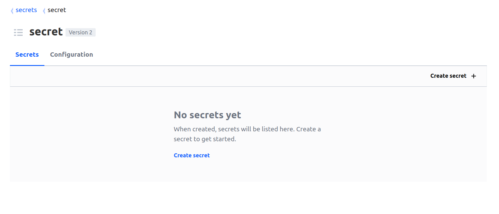
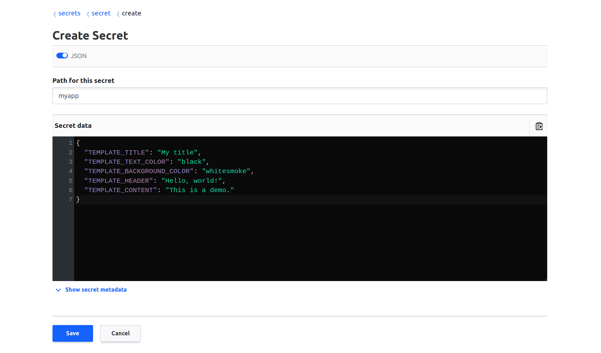
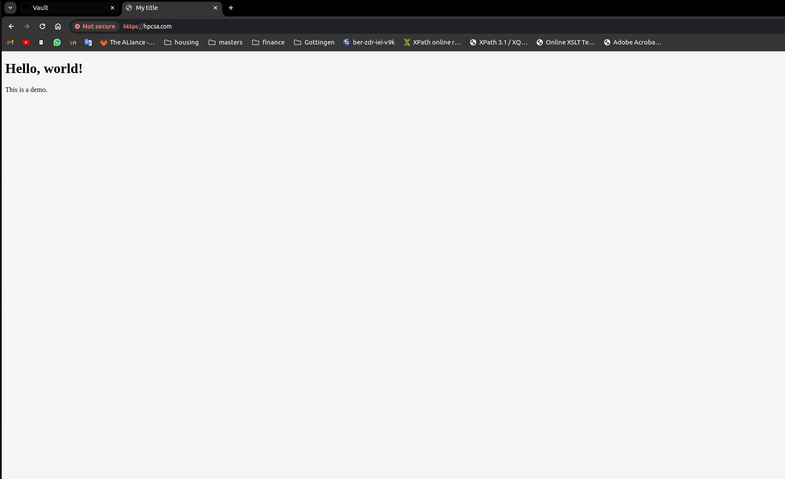

# helm-keycloak
Smart injection of environment variables in already running kubernetes cluster

## Build architecture


## Install microk8s with helm
01. cd VAULT_DEMO
02. sudo ./deploy_with_microk8s.sh

## INITIAL SETUP 
1. Visit https://hpcsa-vault.com/
2. accept self sining certificate
3. the followig page will be visbile


4. Enter token: admin
5. Click on Sign in
6. VAULT HOOME PAGE: 


7. Goto secret and click create new secret


8. path for secret: myapp
   Toggle json and add following json:  

```json
   {
  "TEMPLATE_TITLE": "My title",
  "TEMPLATE_TEXT_COLOR": "black",
  "TEMPLATE_BACKGROUND_COLOR": "whitesmoke",
  "TEMPLATE_HEADER": "Hello, world!",
  "TEMPLATE_CONTENT": "This is a demo."
  }
```


9. click on save

## Build verification
1. Visit https://hpcsa.com/ and verify the base page 


## Incremental changes
1. Update any of the variable defined in the vault
2. Wait for few seconds, frontend will show 503 service not available error, which indicates that service is restarting
3. The changes will be reflectes as soon as container restarts


Things to do: 
- diagram (sequence diagram or component diagram)
- use basic application
- report initial version
- thesis topic selection

https://mermaid.js.org/syntax/sequenceDiagram.html
https://hps.vi4io.org/research/open-theses
https://data.goettingen-research-online.de/dataverse/gwdg-final-theses